# Ablation Study: Fast-dLLM for Commit Message Generation

## Overview

This report analyzes **66 dLLM configurations** against an **autoregressive (AR) baseline** on a set of **1,000 commit message generation tasks**.

The dLLM model is `Efficient-Large-Model/Fast_dLLM_v2_1.5B` using the Fast-dLLM speculative/masked diffusion decoding strategy. The AR baseline uses the same architecture with standard autoregressive decoding.

### Hyperparameters Explored

| Parameter | Values |
| --- | --- |
| Block Size (bs) | 16, 32, 64 |
| Small Block Size (sbs) | 4, 8, 16, 32 |
| Confidence Threshold | 0.2, 0.4, 0.6, 0.8, 1.0 |
| Max New Tokens (mnt) | 32, 64, 128, 256, 512, 1024 |
| Batch Size | 1, 4 |
| Cache | True (all configs) |

## AR Baseline Results

| Metric | Value |
| --- | --- |
| METEOR | 0.0992 |
| ROUGE-L | 0.1486 |
| ROUGE-1 | 0.1663 |
| ROUGE-2 | 0.0374 |
| BLEU-4 | 0.0221 |
| BLEU-NORM | 0.0264 |
| BLEU-CODE | 0.0287 |
| CIDEr | 0.2048 |
| Tokens/sec | 9.53 |
| ms/token | 111.439 |
| Avg generated tokens | 16.59 |

## Top 10 dLLM Configurations by METEOR

| Config | Threshold | METEOR | ROUGE-L | ROUGE-1 | BLEU-4 | BLEU-CODE | CIDEr | Tok/s | Tok/Step | Avg Gen Tok |
| --- | --- | --- | --- | --- | --- | --- | --- | --- | --- | --- |
| bs16_sbs4_th1.0_cacheTrue_batch1_mnt128 | 1.0 | 0.1155 | 0.1275 | 0.1438 | 0.0158 | 0.0207 | 0.2059 | 6.2 | 1.00 | 39.5 |
| bs16_sbs4_th0.8_cacheTrue_batch1_mnt128 | 0.8 | 0.1137 | 0.1268 | 0.1430 | 0.0163 | 0.0206 | 0.2081 | 7.7 | 1.31 | 41.1 |
| bs16_sbs4_th0.6_cacheTrue_batch1_mnt128 | 0.6 | 0.1114 | 0.1257 | 0.1410 | 0.0163 | 0.0207 | 0.2082 | 8.3 | 1.44 | 41.8 |
| bs16_sbs8_th0.4_cacheTrue_batch1_mnt128 | 0.4 | 0.1110 | 0.1195 | 0.1345 | 0.0168 | 0.0199 | 0.2137 | 10.0 | 1.84 | 45.4 |
| bs64_sbs16_th1.0_cacheTrue_batch1_mnt128 | 1.0 | 0.1109 | 0.1213 | 0.1349 | 0.0180 | 0.0231 | 0.2251 | 6.5 | 1.00 | 62.0 |
| bs64_sbs16_th0.8_cacheTrue_batch1_mnt128 | 0.8 | 0.1102 | 0.1207 | 0.1349 | 0.0179 | 0.0225 | 0.2210 | 10.6 | 1.82 | 61.7 |
| bs16_sbs8_th1.0_cacheTrue_batch1_mnt128 | 1.0 | 0.1098 | 0.1209 | 0.1354 | 0.0156 | 0.0202 | 0.2067 | 6.2 | 1.00 | 40.7 |
| bs64_sbs32_th0.8_cacheTrue_batch1_mnt128 | 0.8 | 0.1097 | 0.1205 | 0.1343 | 0.0175 | 0.0220 | 0.2201 | 10.8 | 1.88 | 62.8 |
| bs16_sbs8_th0.8_cacheTrue_batch1_mnt128 | 0.8 | 0.1096 | 0.1207 | 0.1354 | 0.0163 | 0.0205 | 0.2140 | 8.0 | 1.38 | 42.2 |
| bs64_sbs32_th1.0_cacheTrue_batch1_mnt128 | 1.0 | 0.1092 | 0.1200 | 0.1340 | 0.0173 | 0.0220 | 0.2175 | 6.4 | 1.00 | 63.0 |

## Top 10 dLLM Configurations by Throughput

| Config | Threshold | METEOR | ROUGE-L | ROUGE-1 | BLEU-4 | BLEU-CODE | CIDEr | Tok/s | Tok/Step | Avg Gen Tok |
| --- | --- | --- | --- | --- | --- | --- | --- | --- | --- | --- |
| bs32_sbs8_th0.2_cacheTrue_batch4_mnt1024 | 0.2 | 0.0859 | 0.1055 | 0.1169 | 0.0156 | 0.0190 | 0.1746 | 24.4 | 4.71 | 178.2 |
| bs32_sbs8_th0.2_cacheTrue_batch4_mnt512 | 0.2 | 0.0859 | 0.1056 | 0.1170 | 0.0156 | 0.0190 | 0.1745 | 23.1 | 4.52 | 119.1 |
| bs64_sbs32_th0.2_cacheTrue_batch1_mnt128 | 0.2 | 0.0868 | 0.1082 | 0.1192 | 0.0142 | 0.0169 | 0.1716 | 20.4 | 4.24 | 76.5 |
| bs32_sbs8_th0.2_cacheTrue_batch4_mnt256 | 0.2 | 0.0860 | 0.1056 | 0.1170 | 0.0156 | 0.0190 | 0.1744 | 19.5 | 4.32 | 89.4 |
| bs64_sbs16_th0.2_cacheTrue_batch1_mnt128 | 0.2 | 0.0855 | 0.1069 | 0.1185 | 0.0146 | 0.0171 | 0.1728 | 18.7 | 3.73 | 74.2 |
| bs32_sbs16_th0.2_cacheTrue_batch1_mnt128 | 0.2 | 0.0859 | 0.1067 | 0.1167 | 0.0148 | 0.0187 | 0.1769 | 18.3 | 3.45 | 67.5 |
| bs32_sbs8_th0.2_cacheTrue_batch1_mnt512 | 0.2 | 0.0866 | 0.1064 | 0.1181 | 0.0157 | 0.0191 | 0.1751 | 17.2 | 3.00 | 104.6 |
| bs32_sbs8_th0.2_cacheTrue_batch1_mnt1024 | 0.2 | 0.0865 | 0.1064 | 0.1181 | 0.0157 | 0.0191 | 0.1752 | 16.4 | 3.05 | 157.6 |
| bs32_sbs8_th0.2_cacheTrue_batch1_mnt128 | 0.2 | 0.0868 | 0.1066 | 0.1182 | 0.0157 | 0.0191 | 0.1747 | 15.7 | 2.83 | 62.6 |
| bs32_sbs8_th0.2_cacheTrue_batch1_mnt256 | 0.2 | 0.0866 | 0.1065 | 0.1181 | 0.0157 | 0.0191 | 0.1748 | 15.6 | 2.93 | 77.8 |

## Analysis: Block Size Sweep (mnt=128, batch=1)

This section isolates the effect of block size and small block size at a fixed max generation length of 128 and batch size of 1.

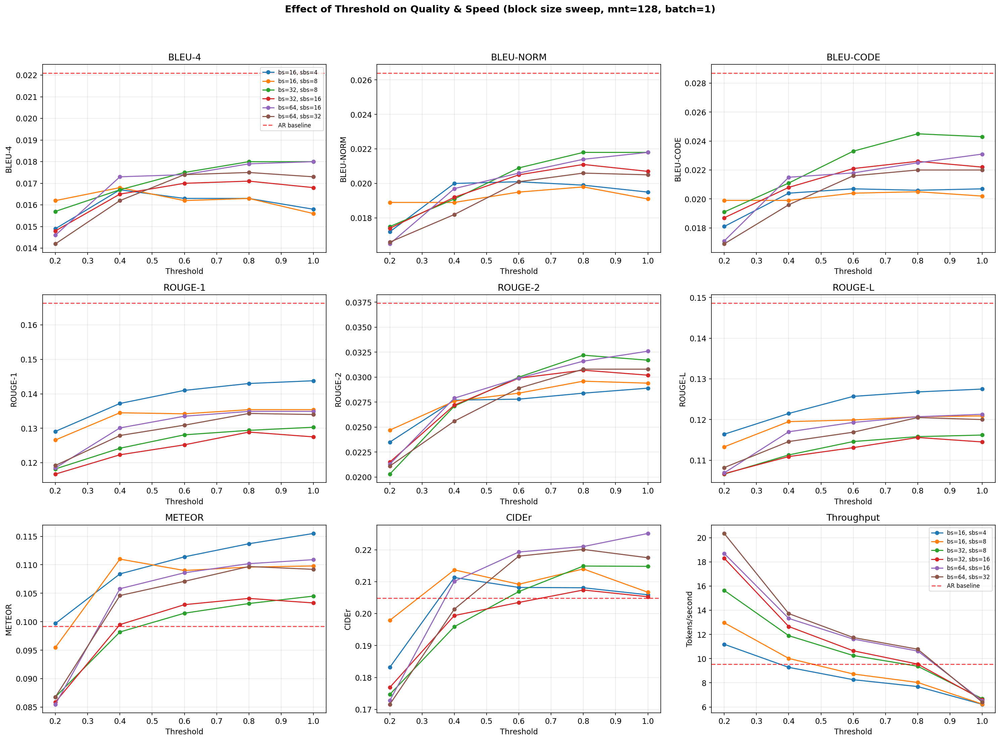

### bs=16, sbs=4

| Config | Threshold | METEOR | ROUGE-L | ROUGE-1 | BLEU-4 | BLEU-CODE | CIDEr | Tok/s | Tok/Step | Avg Gen Tok |
| --- | --- | --- | --- | --- | --- | --- | --- | --- | --- | --- |
| bs16_sbs4_th0.2_cacheTrue_batch1_mnt128 | 0.2 | 0.0997 | 0.1164 | 0.1291 | 0.0149 | 0.0181 | 0.1832 | 11.2 | 2.16 | 47.1 |
| bs16_sbs4_th0.4_cacheTrue_batch1_mnt128 | 0.4 | 0.1084 | 0.1215 | 0.1372 | 0.0167 | 0.0204 | 0.2113 | 9.3 | 1.66 | 44.6 |
| bs16_sbs4_th0.6_cacheTrue_batch1_mnt128 | 0.6 | 0.1114 | 0.1257 | 0.1410 | 0.0163 | 0.0207 | 0.2082 | 8.3 | 1.44 | 41.8 |
| bs16_sbs4_th0.8_cacheTrue_batch1_mnt128 | 0.8 | 0.1137 | 0.1268 | 0.1430 | 0.0163 | 0.0206 | 0.2081 | 7.7 | 1.31 | 41.1 |
| bs16_sbs4_th1.0_cacheTrue_batch1_mnt128 | 1.0 | 0.1155 | 0.1275 | 0.1438 | 0.0158 | 0.0207 | 0.2059 | 6.2 | 1.00 | 39.5 |

### bs=16, sbs=8

| Config | Threshold | METEOR | ROUGE-L | ROUGE-1 | BLEU-4 | BLEU-CODE | CIDEr | Tok/s | Tok/Step | Avg Gen Tok |
| --- | --- | --- | --- | --- | --- | --- | --- | --- | --- | --- |
| bs16_sbs8_th0.2_cacheTrue_batch1_mnt128 | 0.2 | 0.0955 | 0.1133 | 0.1266 | 0.0162 | 0.0199 | 0.1979 | 13.0 | 2.60 | 50.8 |
| bs16_sbs8_th0.4_cacheTrue_batch1_mnt128 | 0.4 | 0.1110 | 0.1195 | 0.1345 | 0.0168 | 0.0199 | 0.2137 | 10.0 | 1.84 | 45.4 |
| bs16_sbs8_th0.6_cacheTrue_batch1_mnt128 | 0.6 | 0.1090 | 0.1199 | 0.1342 | 0.0162 | 0.0204 | 0.2092 | 8.7 | 1.54 | 42.9 |
| bs16_sbs8_th0.8_cacheTrue_batch1_mnt128 | 0.8 | 0.1096 | 0.1207 | 0.1354 | 0.0163 | 0.0205 | 0.2140 | 8.0 | 1.38 | 42.2 |
| bs16_sbs8_th1.0_cacheTrue_batch1_mnt128 | 1.0 | 0.1098 | 0.1209 | 0.1354 | 0.0156 | 0.0202 | 0.2067 | 6.2 | 1.00 | 40.7 |

### bs=32, sbs=8

| Config | Threshold | METEOR | ROUGE-L | ROUGE-1 | BLEU-4 | BLEU-CODE | CIDEr | Tok/s | Tok/Step | Avg Gen Tok |
| --- | --- | --- | --- | --- | --- | --- | --- | --- | --- | --- |
| bs32_sbs8_th0.2_cacheTrue_batch1_mnt128 | 0.2 | 0.0868 | 0.1066 | 0.1182 | 0.0157 | 0.0191 | 0.1747 | 15.7 | 2.83 | 62.6 |
| bs32_sbs8_th0.4_cacheTrue_batch1_mnt128 | 0.4 | 0.0982 | 0.1113 | 0.1242 | 0.0167 | 0.0211 | 0.1959 | 11.9 | 2.03 | 54.0 |
| bs32_sbs8_th0.6_cacheTrue_batch1_mnt128 | 0.6 | 0.1015 | 0.1146 | 0.1281 | 0.0175 | 0.0233 | 0.2069 | 10.3 | 1.71 | 49.6 |
| bs32_sbs8_th0.8_cacheTrue_batch1_mnt128 | 0.8 | 0.1032 | 0.1158 | 0.1294 | 0.0180 | 0.0245 | 0.2149 | 9.4 | 1.53 | 47.4 |
| bs32_sbs8_th1.0_cacheTrue_batch1_mnt128 | 1.0 | 0.1045 | 0.1162 | 0.1303 | 0.0180 | 0.0243 | 0.2148 | 6.7 | 1.00 | 46.7 |

### bs=32, sbs=16

| Config | Threshold | METEOR | ROUGE-L | ROUGE-1 | BLEU-4 | BLEU-CODE | CIDEr | Tok/s | Tok/Step | Avg Gen Tok |
| --- | --- | --- | --- | --- | --- | --- | --- | --- | --- | --- |
| bs32_sbs16_th0.2_cacheTrue_batch1_mnt128 | 0.2 | 0.0859 | 0.1067 | 0.1167 | 0.0148 | 0.0187 | 0.1769 | 18.3 | 3.45 | 67.5 |
| bs32_sbs16_th0.4_cacheTrue_batch1_mnt128 | 0.4 | 0.0995 | 0.1109 | 0.1223 | 0.0165 | 0.0208 | 0.1994 | 12.7 | 2.21 | 56.2 |
| bs32_sbs16_th0.6_cacheTrue_batch1_mnt128 | 0.6 | 0.1030 | 0.1131 | 0.1252 | 0.0170 | 0.0221 | 0.2035 | 10.7 | 1.80 | 50.8 |
| bs32_sbs16_th0.8_cacheTrue_batch1_mnt128 | 0.8 | 0.1041 | 0.1156 | 0.1289 | 0.0171 | 0.0226 | 0.2074 | 9.6 | 1.58 | 47.1 |
| bs32_sbs16_th1.0_cacheTrue_batch1_mnt128 | 1.0 | 0.1033 | 0.1145 | 0.1275 | 0.0168 | 0.0222 | 0.2053 | 6.6 | 1.00 | 46.2 |

### bs=64, sbs=16

| Config | Threshold | METEOR | ROUGE-L | ROUGE-1 | BLEU-4 | BLEU-CODE | CIDEr | Tok/s | Tok/Step | Avg Gen Tok |
| --- | --- | --- | --- | --- | --- | --- | --- | --- | --- | --- |
| bs64_sbs16_th0.2_cacheTrue_batch1_mnt128 | 0.2 | 0.0855 | 0.1069 | 0.1185 | 0.0146 | 0.0171 | 0.1728 | 18.7 | 3.73 | 74.2 |
| bs64_sbs16_th0.4_cacheTrue_batch1_mnt128 | 0.4 | 0.1058 | 0.1170 | 0.1301 | 0.0173 | 0.0215 | 0.2101 | 13.3 | 2.39 | 68.1 |
| bs64_sbs16_th0.6_cacheTrue_batch1_mnt128 | 0.6 | 0.1086 | 0.1193 | 0.1335 | 0.0174 | 0.0218 | 0.2193 | 11.6 | 2.04 | 63.9 |
| bs64_sbs16_th0.8_cacheTrue_batch1_mnt128 | 0.8 | 0.1102 | 0.1207 | 0.1349 | 0.0179 | 0.0225 | 0.2210 | 10.6 | 1.82 | 61.7 |
| bs64_sbs16_th1.0_cacheTrue_batch1_mnt128 | 1.0 | 0.1109 | 0.1213 | 0.1349 | 0.0180 | 0.0231 | 0.2251 | 6.5 | 1.00 | 62.0 |

### bs=64, sbs=32

| Config | Threshold | METEOR | ROUGE-L | ROUGE-1 | BLEU-4 | BLEU-CODE | CIDEr | Tok/s | Tok/Step | Avg Gen Tok |
| --- | --- | --- | --- | --- | --- | --- | --- | --- | --- | --- |
| bs64_sbs32_th0.2_cacheTrue_batch1_mnt128 | 0.2 | 0.0868 | 0.1082 | 0.1192 | 0.0142 | 0.0169 | 0.1716 | 20.4 | 4.24 | 76.5 |
| bs64_sbs32_th0.4_cacheTrue_batch1_mnt128 | 0.4 | 0.1046 | 0.1146 | 0.1279 | 0.0162 | 0.0196 | 0.2014 | 13.7 | 2.51 | 70.0 |
| bs64_sbs32_th0.6_cacheTrue_batch1_mnt128 | 0.6 | 0.1071 | 0.1169 | 0.1309 | 0.0174 | 0.0216 | 0.2180 | 11.8 | 2.10 | 65.3 |
| bs64_sbs32_th0.8_cacheTrue_batch1_mnt128 | 0.8 | 0.1097 | 0.1205 | 0.1343 | 0.0175 | 0.0220 | 0.2201 | 10.8 | 1.88 | 62.8 |
| bs64_sbs32_th1.0_cacheTrue_batch1_mnt128 | 1.0 | 0.1092 | 0.1200 | 0.1340 | 0.0173 | 0.0220 | 0.2175 | 6.4 | 1.00 | 63.0 |

## Analysis: Max New Tokens Sweep (bs=32, sbs=8, batch=1)

This section examines how the maximum generation length affects quality and speed.

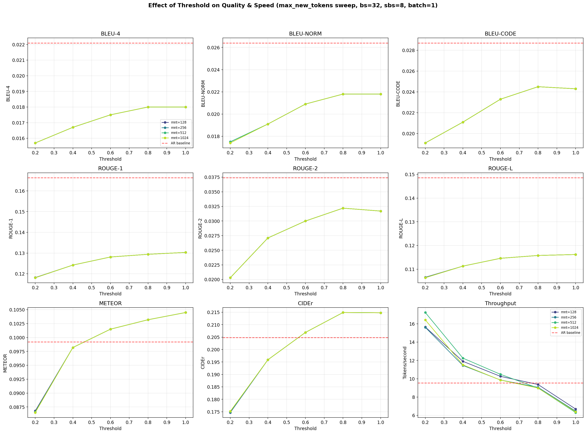

### mnt=128

| Config | Threshold | METEOR | ROUGE-L | ROUGE-1 | BLEU-4 | BLEU-CODE | CIDEr | Tok/s | Tok/Step | Avg Gen Tok |
| --- | --- | --- | --- | --- | --- | --- | --- | --- | --- | --- |
| bs32_sbs8_th0.2_cacheTrue_batch1_mnt128 | 0.2 | 0.0868 | 0.1066 | 0.1182 | 0.0157 | 0.0191 | 0.1747 | 15.7 | 2.83 | 62.6 |
| bs32_sbs8_th0.4_cacheTrue_batch1_mnt128 | 0.4 | 0.0982 | 0.1113 | 0.1242 | 0.0167 | 0.0211 | 0.1959 | 11.9 | 2.03 | 54.0 |
| bs32_sbs8_th0.6_cacheTrue_batch1_mnt128 | 0.6 | 0.1015 | 0.1146 | 0.1281 | 0.0175 | 0.0233 | 0.2069 | 10.3 | 1.71 | 49.6 |
| bs32_sbs8_th0.8_cacheTrue_batch1_mnt128 | 0.8 | 0.1032 | 0.1158 | 0.1294 | 0.0180 | 0.0245 | 0.2149 | 9.4 | 1.53 | 47.4 |
| bs32_sbs8_th1.0_cacheTrue_batch1_mnt128 | 1.0 | 0.1045 | 0.1162 | 0.1303 | 0.0180 | 0.0243 | 0.2148 | 6.7 | 1.00 | 46.7 |

### mnt=256

| Config | Threshold | METEOR | ROUGE-L | ROUGE-1 | BLEU-4 | BLEU-CODE | CIDEr | Tok/s | Tok/Step | Avg Gen Tok |
| --- | --- | --- | --- | --- | --- | --- | --- | --- | --- | --- |
| bs32_sbs8_th0.2_cacheTrue_batch1_mnt256 | 0.2 | 0.0866 | 0.1065 | 0.1181 | 0.0157 | 0.0191 | 0.1748 | 15.6 | 2.93 | 77.8 |
| bs32_sbs8_th0.4_cacheTrue_batch1_mnt256 | 0.4 | 0.0982 | 0.1113 | 0.1242 | 0.0167 | 0.0211 | 0.1959 | 11.4 | 2.06 | 58.6 |
| bs32_sbs8_th0.6_cacheTrue_batch1_mnt256 | 0.6 | 0.1015 | 0.1146 | 0.1281 | 0.0175 | 0.0233 | 0.2069 | 9.9 | 1.73 | 52.8 |
| bs32_sbs8_th0.8_cacheTrue_batch1_mnt256 | 0.8 | 0.1032 | 0.1158 | 0.1294 | 0.0180 | 0.0245 | 0.2149 | 9.1 | 1.54 | 49.5 |
| bs32_sbs8_th1.0_cacheTrue_batch1_mnt256 | 1.0 | 0.1045 | 0.1162 | 0.1303 | 0.0180 | 0.0243 | 0.2148 | 6.5 | 1.00 | 47.3 |

### mnt=512

| Config | Threshold | METEOR | ROUGE-L | ROUGE-1 | BLEU-4 | BLEU-CODE | CIDEr | Tok/s | Tok/Step | Avg Gen Tok |
| --- | --- | --- | --- | --- | --- | --- | --- | --- | --- | --- |
| bs32_sbs8_th0.2_cacheTrue_batch1_mnt512 | 0.2 | 0.0866 | 0.1064 | 0.1181 | 0.0157 | 0.0191 | 0.1751 | 17.2 | 3.00 | 104.6 |
| bs32_sbs8_th0.4_cacheTrue_batch1_mnt512 | 0.4 | 0.0982 | 0.1113 | 0.1242 | 0.0167 | 0.0211 | 0.1959 | 12.2 | 2.07 | 64.7 |
| bs32_sbs8_th0.6_cacheTrue_batch1_mnt512 | 0.6 | 0.1015 | 0.1146 | 0.1281 | 0.0175 | 0.0233 | 0.2069 | 10.5 | 1.74 | 57.3 |
| bs32_sbs8_th0.8_cacheTrue_batch1_mnt512 | 0.8 | 0.1032 | 0.1158 | 0.1294 | 0.0180 | 0.0245 | 0.2149 | 9.0 | 1.54 | 52.2 |
| bs32_sbs8_th1.0_cacheTrue_batch1_mnt512 | 1.0 | 0.1045 | 0.1162 | 0.1303 | 0.0180 | 0.0243 | 0.2148 | 6.3 | 1.00 | 47.5 |

### mnt=1024

| Config | Threshold | METEOR | ROUGE-L | ROUGE-1 | BLEU-4 | BLEU-CODE | CIDEr | Tok/s | Tok/Step | Avg Gen Tok |
| --- | --- | --- | --- | --- | --- | --- | --- | --- | --- | --- |
| bs32_sbs8_th0.2_cacheTrue_batch1_mnt1024 | 0.2 | 0.0865 | 0.1064 | 0.1181 | 0.0157 | 0.0191 | 0.1752 | 16.4 | 3.05 | 157.6 |
| bs32_sbs8_th0.4_cacheTrue_batch1_mnt1024 | 0.4 | 0.0982 | 0.1113 | 0.1242 | 0.0167 | 0.0211 | 0.1959 | 11.5 | 2.08 | 74.8 |
| bs32_sbs8_th0.6_cacheTrue_batch1_mnt1024 | 0.6 | 0.1015 | 0.1146 | 0.1281 | 0.0175 | 0.0233 | 0.2069 | 9.8 | 1.75 | 64.3 |
| bs32_sbs8_th0.8_cacheTrue_batch1_mnt1024 | 0.8 | 0.1032 | 0.1158 | 0.1294 | 0.0180 | 0.0245 | 0.2149 | 9.0 | 1.54 | 55.4 |
| bs32_sbs8_th1.0_cacheTrue_batch1_mnt1024 | 1.0 | 0.1045 | 0.1162 | 0.1303 | 0.0180 | 0.0243 | 0.2148 | 6.4 | 1.00 | 48.0 |

## Analysis: Batch Size Effect (bs=32, sbs=8)

Comparing batch_size=1 vs batch_size=4 across different max_new_tokens values.

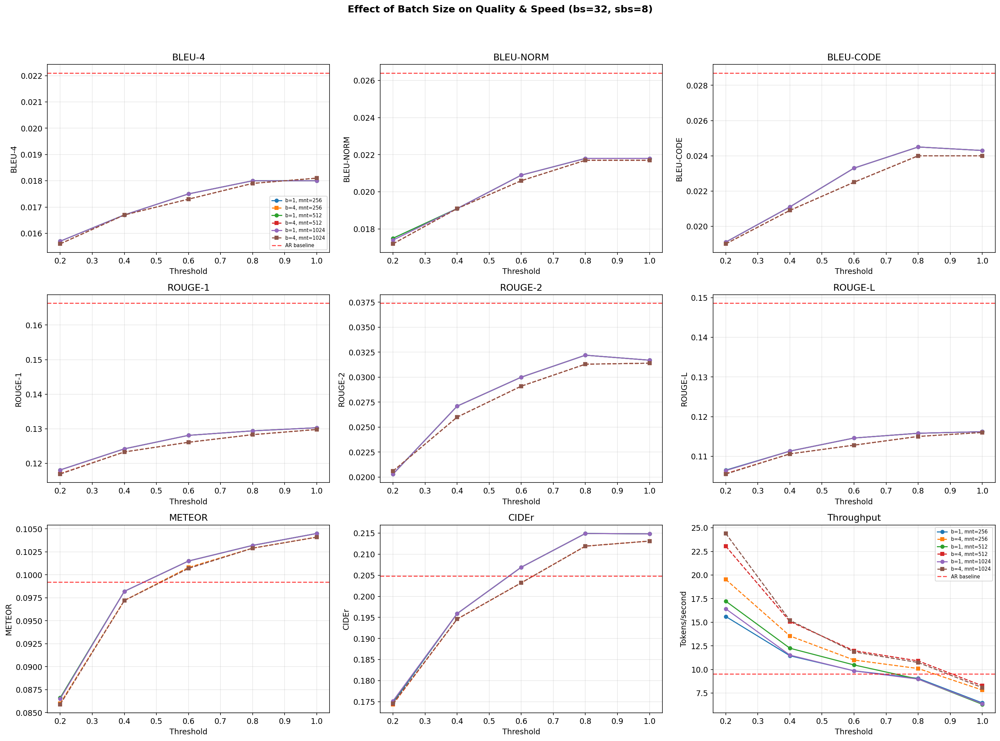

### mnt=256: batch=1 vs batch=4

**Batch size = 1:**

| Config | Threshold | METEOR | ROUGE-L | ROUGE-1 | BLEU-4 | BLEU-CODE | CIDEr | Tok/s | Tok/Step | Avg Gen Tok |
| --- | --- | --- | --- | --- | --- | --- | --- | --- | --- | --- |
| bs32_sbs8_th0.2_cacheTrue_batch1_mnt256 | 0.2 | 0.0866 | 0.1065 | 0.1181 | 0.0157 | 0.0191 | 0.1748 | 15.6 | 2.93 | 77.8 |
| bs32_sbs8_th0.4_cacheTrue_batch1_mnt256 | 0.4 | 0.0982 | 0.1113 | 0.1242 | 0.0167 | 0.0211 | 0.1959 | 11.4 | 2.06 | 58.6 |
| bs32_sbs8_th0.6_cacheTrue_batch1_mnt256 | 0.6 | 0.1015 | 0.1146 | 0.1281 | 0.0175 | 0.0233 | 0.2069 | 9.9 | 1.73 | 52.8 |
| bs32_sbs8_th0.8_cacheTrue_batch1_mnt256 | 0.8 | 0.1032 | 0.1158 | 0.1294 | 0.0180 | 0.0245 | 0.2149 | 9.1 | 1.54 | 49.5 |
| bs32_sbs8_th1.0_cacheTrue_batch1_mnt256 | 1.0 | 0.1045 | 0.1162 | 0.1303 | 0.0180 | 0.0243 | 0.2148 | 6.5 | 1.00 | 47.3 |

**Batch size = 4:**

| Config | Threshold | METEOR | ROUGE-L | ROUGE-1 | BLEU-4 | BLEU-CODE | CIDEr | Tok/s | Tok/Step | Avg Gen Tok |
| --- | --- | --- | --- | --- | --- | --- | --- | --- | --- | --- |
| bs32_sbs8_th0.2_cacheTrue_batch4_mnt256 | 0.2 | 0.0860 | 0.1056 | 0.1170 | 0.0156 | 0.0190 | 0.1744 | 19.5 | 4.32 | 89.4 |
| bs32_sbs8_th0.4_cacheTrue_batch4_mnt256 | 0.4 | 0.0972 | 0.1106 | 0.1233 | 0.0167 | 0.0209 | 0.1946 | 13.6 | 2.88 | 65.3 |
| bs32_sbs8_th0.6_cacheTrue_batch4_mnt256 | 0.6 | 0.1008 | 0.1128 | 0.1261 | 0.0173 | 0.0225 | 0.2032 | 11.0 | 2.27 | 54.6 |
| bs32_sbs8_th0.8_cacheTrue_batch4_mnt256 | 0.8 | 0.1029 | 0.1150 | 0.1283 | 0.0179 | 0.0240 | 0.2119 | 10.1 | 2.05 | 51.2 |
| bs32_sbs8_th1.0_cacheTrue_batch4_mnt256 | 1.0 | 0.1041 | 0.1160 | 0.1298 | 0.0181 | 0.0240 | 0.2131 | 7.8 | 1.47 | 48.4 |

### mnt=512: batch=1 vs batch=4

**Batch size = 1:**

| Config | Threshold | METEOR | ROUGE-L | ROUGE-1 | BLEU-4 | BLEU-CODE | CIDEr | Tok/s | Tok/Step | Avg Gen Tok |
| --- | --- | --- | --- | --- | --- | --- | --- | --- | --- | --- |
| bs32_sbs8_th0.2_cacheTrue_batch1_mnt512 | 0.2 | 0.0866 | 0.1064 | 0.1181 | 0.0157 | 0.0191 | 0.1751 | 17.2 | 3.00 | 104.6 |
| bs32_sbs8_th0.4_cacheTrue_batch1_mnt512 | 0.4 | 0.0982 | 0.1113 | 0.1242 | 0.0167 | 0.0211 | 0.1959 | 12.2 | 2.07 | 64.7 |
| bs32_sbs8_th0.6_cacheTrue_batch1_mnt512 | 0.6 | 0.1015 | 0.1146 | 0.1281 | 0.0175 | 0.0233 | 0.2069 | 10.5 | 1.74 | 57.3 |
| bs32_sbs8_th0.8_cacheTrue_batch1_mnt512 | 0.8 | 0.1032 | 0.1158 | 0.1294 | 0.0180 | 0.0245 | 0.2149 | 9.0 | 1.54 | 52.2 |
| bs32_sbs8_th1.0_cacheTrue_batch1_mnt512 | 1.0 | 0.1045 | 0.1162 | 0.1303 | 0.0180 | 0.0243 | 0.2148 | 6.3 | 1.00 | 47.5 |

**Batch size = 4:**

| Config | Threshold | METEOR | ROUGE-L | ROUGE-1 | BLEU-4 | BLEU-CODE | CIDEr | Tok/s | Tok/Step | Avg Gen Tok |
| --- | --- | --- | --- | --- | --- | --- | --- | --- | --- | --- |
| bs32_sbs8_th0.2_cacheTrue_batch4_mnt512 | 0.2 | 0.0859 | 0.1056 | 0.1170 | 0.0156 | 0.0190 | 0.1745 | 23.1 | 4.52 | 119.1 |
| bs32_sbs8_th0.4_cacheTrue_batch4_mnt512 | 0.4 | 0.0972 | 0.1106 | 0.1233 | 0.0167 | 0.0209 | 0.1946 | 15.1 | 2.94 | 74.1 |
| bs32_sbs8_th0.6_cacheTrue_batch4_mnt512 | 0.6 | 0.1007 | 0.1128 | 0.1261 | 0.0173 | 0.0225 | 0.2032 | 12.0 | 2.29 | 58.1 |
| bs32_sbs8_th0.8_cacheTrue_batch4_mnt512 | 0.8 | 0.1029 | 0.1150 | 0.1283 | 0.0179 | 0.0240 | 0.2119 | 10.9 | 2.06 | 54.0 |
| bs32_sbs8_th1.0_cacheTrue_batch4_mnt512 | 1.0 | 0.1041 | 0.1160 | 0.1298 | 0.0181 | 0.0240 | 0.2131 | 8.3 | 1.47 | 48.9 |

### mnt=1024: batch=1 vs batch=4

**Batch size = 1:**

| Config | Threshold | METEOR | ROUGE-L | ROUGE-1 | BLEU-4 | BLEU-CODE | CIDEr | Tok/s | Tok/Step | Avg Gen Tok |
| --- | --- | --- | --- | --- | --- | --- | --- | --- | --- | --- |
| bs32_sbs8_th0.2_cacheTrue_batch1_mnt1024 | 0.2 | 0.0865 | 0.1064 | 0.1181 | 0.0157 | 0.0191 | 0.1752 | 16.4 | 3.05 | 157.6 |
| bs32_sbs8_th0.4_cacheTrue_batch1_mnt1024 | 0.4 | 0.0982 | 0.1113 | 0.1242 | 0.0167 | 0.0211 | 0.1959 | 11.5 | 2.08 | 74.8 |
| bs32_sbs8_th0.6_cacheTrue_batch1_mnt1024 | 0.6 | 0.1015 | 0.1146 | 0.1281 | 0.0175 | 0.0233 | 0.2069 | 9.8 | 1.75 | 64.3 |
| bs32_sbs8_th0.8_cacheTrue_batch1_mnt1024 | 0.8 | 0.1032 | 0.1158 | 0.1294 | 0.0180 | 0.0245 | 0.2149 | 9.0 | 1.54 | 55.4 |
| bs32_sbs8_th1.0_cacheTrue_batch1_mnt1024 | 1.0 | 0.1045 | 0.1162 | 0.1303 | 0.0180 | 0.0243 | 0.2148 | 6.4 | 1.00 | 48.0 |

**Batch size = 4:**

| Config | Threshold | METEOR | ROUGE-L | ROUGE-1 | BLEU-4 | BLEU-CODE | CIDEr | Tok/s | Tok/Step | Avg Gen Tok |
| --- | --- | --- | --- | --- | --- | --- | --- | --- | --- | --- |
| bs32_sbs8_th0.2_cacheTrue_batch4_mnt1024 | 0.2 | 0.0859 | 0.1055 | 0.1169 | 0.0156 | 0.0190 | 0.1746 | 24.4 | 4.71 | 178.2 |
| bs32_sbs8_th0.4_cacheTrue_batch4_mnt1024 | 0.4 | 0.0972 | 0.1106 | 0.1233 | 0.0167 | 0.0209 | 0.1946 | 15.2 | 3.00 | 89.3 |
| bs32_sbs8_th0.6_cacheTrue_batch4_mnt1024 | 0.6 | 0.1007 | 0.1128 | 0.1261 | 0.0173 | 0.0225 | 0.2032 | 11.9 | 2.32 | 63.4 |
| bs32_sbs8_th0.8_cacheTrue_batch4_mnt1024 | 0.8 | 0.1029 | 0.1150 | 0.1283 | 0.0179 | 0.0240 | 0.2119 | 10.7 | 2.08 | 58.0 |
| bs32_sbs8_th1.0_cacheTrue_batch4_mnt1024 | 1.0 | 0.1041 | 0.1160 | 0.1298 | 0.0181 | 0.0240 | 0.2131 | 8.1 | 1.47 | 49.9 |

## Heatmaps (bs=32, sbs=8)

These heatmaps show how METEOR, ROUGE-L, and throughput vary across threshold and max_new_tokens for the bs=32, sbs=8 configuration.

### Batch size = 1

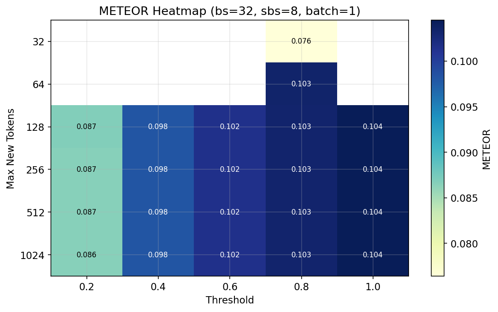

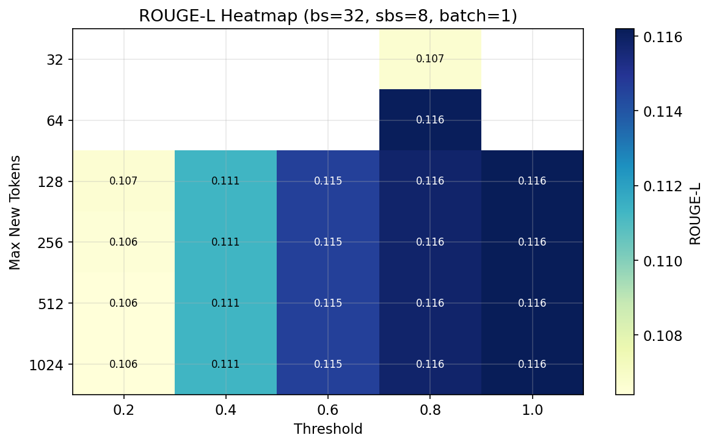

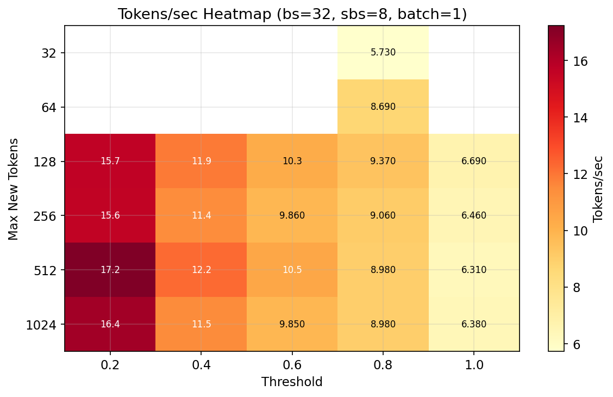

### Batch size = 4

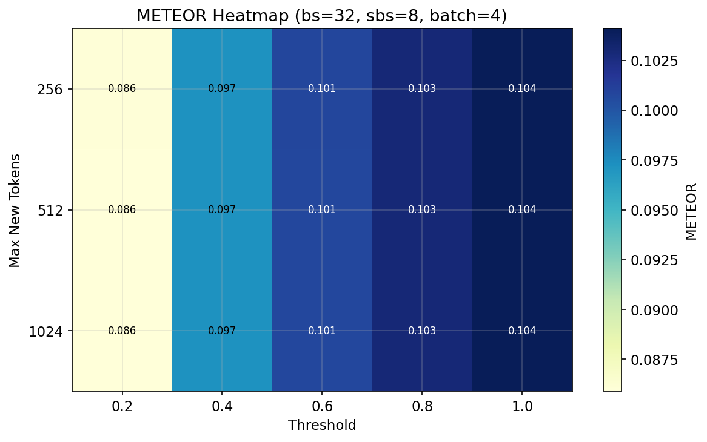

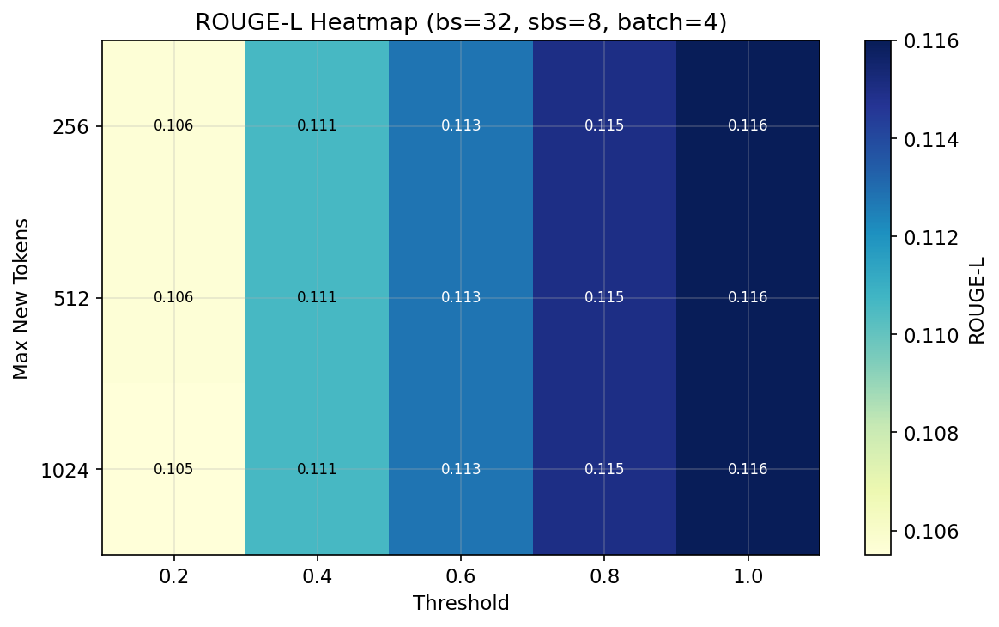

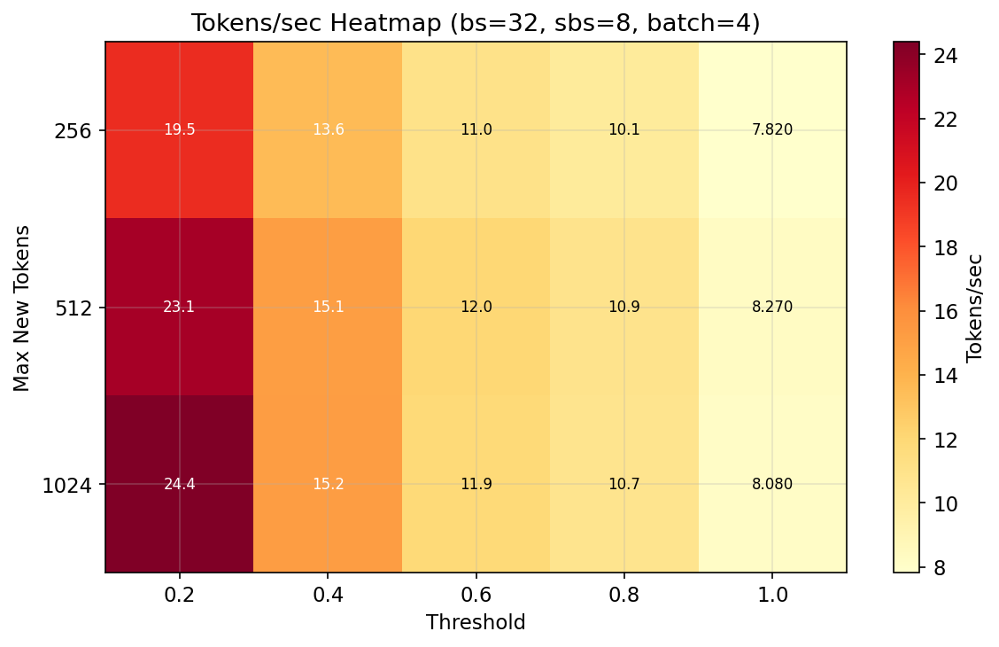

## Analysis: Low Max-New-Tokens (mnt=32, mnt=64) at Threshold=0.8

These experiments test very short generation limits with varying block/sub-block sizes. Since commit messages are typically short (~5-20 tokens), constraining the output length may reduce verbosity and improve precision-based metrics.

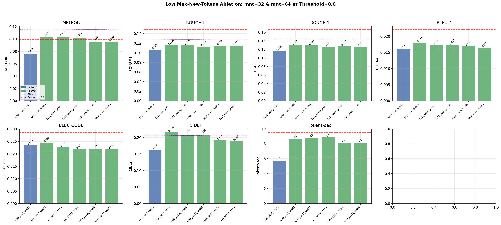

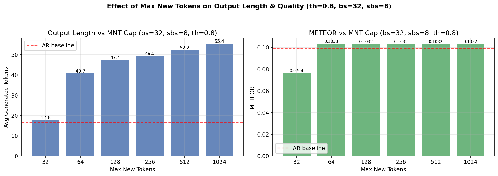

| Config | bs | sbs | mnt | METEOR | ROUGE-L | ROUGE-1 | BLEU-4 | BLEU-CODE | CIDEr | Tok/s | Tok/Step | Avg Gen Tok |
| --- | --- | --- | --- | --- | --- | --- | --- | --- | --- | --- | --- | --- |
| bs32_sbs8_th0.8_cacheTrue_batch1_mnt32 | 32 | 8 | 32 | 0.0764 | 0.1067 | 0.1163 | 0.0160 | 0.0235 | 0.1623 | 5.7 | 1.33 | 17.8 |
| bs32_sbs8_th0.8_cacheTrue_batch1_mnt64 | 32 | 8 | 64 | 0.1033 | 0.1161 | 0.1297 | 0.0181 | 0.0246 | 0.2157 | 8.7 | 1.49 | 40.7 |
| bs32_sbs16_th0.8_cacheTrue_batch1_mnt64 | 32 | 16 | 64 | 0.1042 | 0.1160 | 0.1293 | 0.0172 | 0.0227 | 0.2087 | 8.8 | 1.53 | 40.5 |
| bs32_sbs32_th0.8_cacheTrue_batch1_mnt64 | 32 | 32 | 64 | 0.1019 | 0.1134 | 0.1256 | 0.0173 | 0.0219 | 0.2082 | 8.8 | 1.57 | 40.9 |
| bs64_sbs16_th0.8_cacheTrue_batch1_mnt64 | 64 | 16 | 64 | 0.0957 | 0.1149 | 0.1272 | 0.0169 | 0.0221 | 0.1913 | 8.1 | 1.53 | 34.0 |
| bs64_sbs32_th0.8_cacheTrue_batch1_mnt64 | 64 | 32 | 64 | 0.0959 | 0.1150 | 0.1268 | 0.0165 | 0.0218 | 0.1889 | 8.1 | 1.56 | 34.1 |

### Comparison: Best Low-MNT vs AR Baseline vs Best Overall dLLM

| Model | mnt | METEOR | ROUGE-L | BLEU-4 | BLEU-CODE | CIDEr | Tok/s | Avg Gen Tok |
| --- | --- | --- | --- | --- | --- | --- | --- | --- |
| AR Baseline | 1024 | 0.0992 | 0.1486 | 0.0221 | 0.0287 | 0.2048 | 9.5 | 16.6 |
| Best overall dLLM | 128 | 0.1155 | 0.1275 | 0.0158 | 0.0207 | 0.2059 | 6.2 | 39.5 |
| Best low-mnt dLLM | 64 | 0.1042 | 0.1160 | 0.0172 | 0.0227 | 0.2087 | 8.8 | 40.5 |

## Quality vs Speed Trade-off

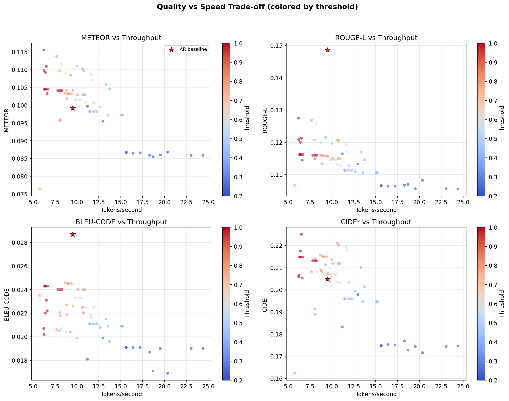

Each point is one dLLM configuration, colored by confidence threshold. The red star marks the AR baseline. Lower thresholds (blue) accept more tokens per step, increasing speed but potentially degrading quality.

## Tokens Accepted per Diffusion Step

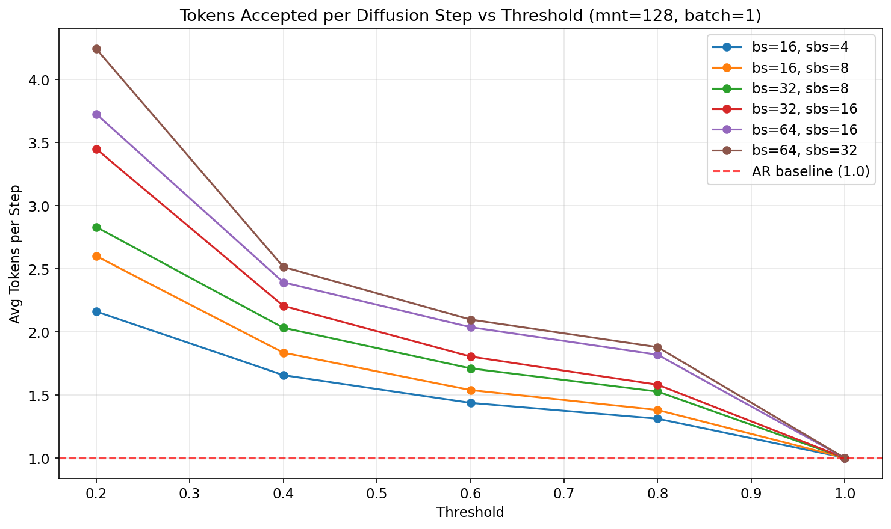

Lower thresholds allow more tokens to be accepted per diffusion step (the core speedup mechanism). The AR baseline always produces exactly 1 token per step.

## Average Generated Token Length

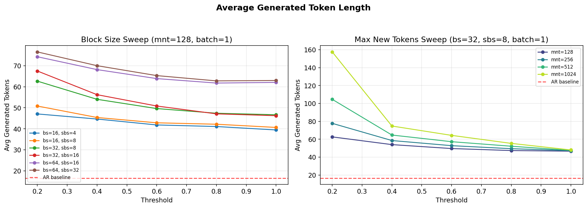

dLLM tends to generate more tokens than the AR baseline, especially at lower thresholds (more aggressive acceptance). Higher max_new_tokens allows longer outputs.

## Speedup over AR Baseline

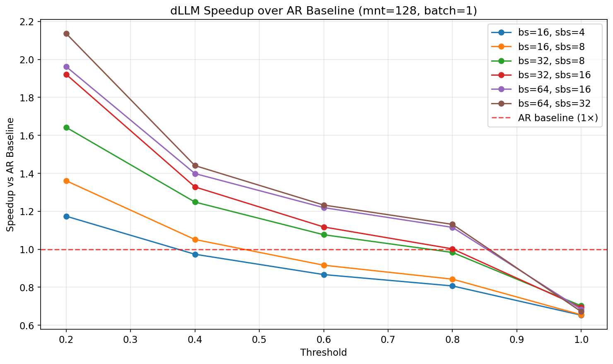

- **Max speedup**: 2.56× (`bs32_sbs8_th0.2_cacheTrue_batch4_mnt1024`)

- **Min speedup**: 0.60× (`bs32_sbs8_th0.8_cacheTrue_batch1_mnt32`)

- **Average speedup**: 1.17× across all 66 configs

## Best Configurations vs AR Baseline

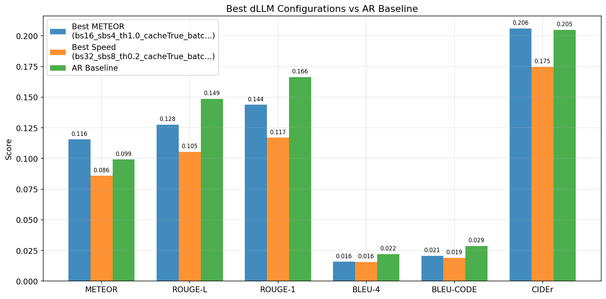

### Comparison Table

| Model | METEOR | ROUGE-L | ROUGE-1 | BLEU-4 | BLEU-CODE | CIDEr | Tok/s | Speedup |
| --- | --- | --- | --- | --- | --- | --- | --- | --- |
| AR Baseline | 0.0992 | 0.1486 | 0.1663 | 0.0221 | 0.0287 | 0.2048 | 9.5 | 1.00× |
| Best METEOR dLLM | 0.1155 | 0.1275 | 0.1438 | 0.0158 | 0.0207 | 0.2059 | 6.2 | 0.65× |
| Best Speed dLLM | 0.0859 | 0.1055 | 0.1169 | 0.0156 | 0.0190 | 0.1746 | 24.4 | 2.56× |

## Key Findings

### 1. Threshold is the Primary Quality-Speed Lever

For the representative config (bs=32, sbs=8, mnt=128, batch=1):

- **Threshold=0.2**: METEOR=0.0868, Tok/s=15.7, Tok/step=2.83

- **Threshold=1.0**: METEOR=0.1045, Tok/s=6.7, Tok/step=1.00

- Higher threshold → stricter acceptance → fewer tokens per step → slower but potentially better quality.

### 2. Block Size Impact

Larger block sizes (64 vs 16) generally allow higher throughput at equivalent thresholds, as more positions are evaluated in parallel per diffusion step. However, quality differences across block sizes are modest compared to the threshold effect.

### 3. Max New Tokens and Output Length

Lower `max_new_tokens` (128) constrains the output and generally results in faster generation and shorter, more focused outputs. Higher values (512, 1024) allow the model to generate longer messages but may include repetitive or verbose content that degrades BLEU/METEOR scores.

### 4. Batch Size Effect

- Average throughput with batch=1: 10.5 tok/s

- Average throughput with batch=4: 13.4 tok/s

Batching increases hardware utilization. Quality metrics remain largely unchanged between batch sizes since each sample is decoded independently.

### 5. dLLM vs AR Baseline

- **45/66** dLLM configs achieve higher METEOR than the AR baseline.

- **38/66** dLLM configs achieve higher CIDEr than the AR baseline.

- **39/66** dLLM configs are faster (higher tok/s) than the AR baseline.

The dLLM approach offers a clear **speed advantage** due to parallel token generation. Quality is competitive with or exceeds the AR baseline for well-tuned threshold values.

---

*Report generated automatically by `50_analyze_ablation.py`.*
